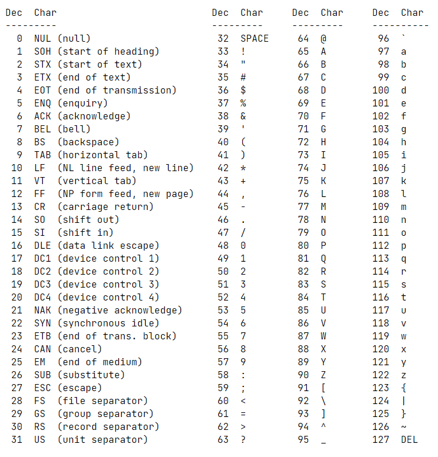

https://www.youtube.com/playlist?list=PLxeKVrYoZO6DNJxUBWIiTO-B6X62SMHVo

# How to Add Header, Check, Compile

```
Fn+F1

norminette -R CheckForbiddenSourceHeader

cc -Wall -Wextra -Werror hello.c bye.c
./a.out
```

# ex00

`write(file descriptor, mem address, byte size);`
When pointing to a single char, use & to find its mem, eg `&c`.

# ex01, ex02, ex03

Write in alphabetical order

1. Declare char
2. Set 1st char
3. for loop such that before or eq to z

'a' refers to ASCII value for a, which is 97. Loop runs until 'z'.



ex02 and ex03 are similar.

# ex04

Cannot use atoi, convert argv manually.
